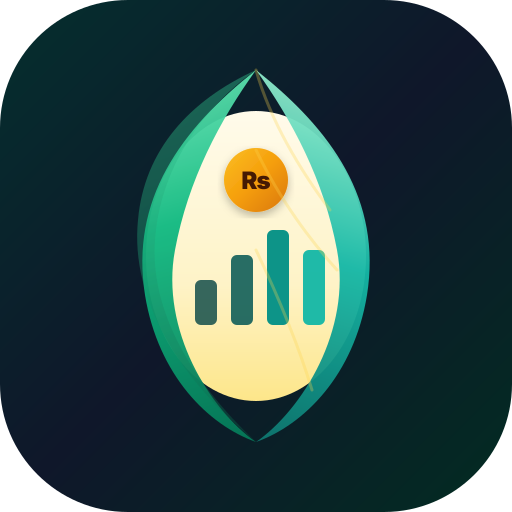

  
  <h1 style="border-bottom: none; margin-bottom: 0;">Cocoon</h1>
  <em>Plan. Track. Grow. — Modern Personal Wealth & Financial Management for Android & Web</em>

 

---

---

## 📖 Overview

**Cocoon** is an intuitive, privacy-first personal wealth and finance companion designed to shelter and nurture your financial future. Built with high performance in mind, Cocoon transforms complex wealth tracking, budget allocations, and Pakistani Rupee / global currency portfolio tracking into clear visual intelligence.

---

## ✨ Features

- 🌿 **Wealth & Asset Tracking**: Monitor cash reserves, bank savings, physical gold, stocks, and crypto portfolios all in one unified dashboard.
- ₨ **Native Multi-Currency & PKR Precision**: Deep support for local Pakistani financial tracking (PKR ₨) as well as global currency conversions.
- 📊 **Visual Cash Flow Analytics**: Interactive charts powered by modern data visualization for expense categorizations and monthly savings trends.
- 🎯 **Smart Budget Allocations & Goal Vaults**: Set customizable spending boundaries and watch savings goals grow inside dedicated visual vaults.
- 🔒 **Privacy-First & Offline Capable**: Your financial numbers stay strictly on your device. Works seamlessly offline without mandatory cloud surveillance.
- 🎨 **Sleek Aesthetic Design**: High-contrast, calm emerald-and-gold visual theme optimized for battery efficiency and night-time budgeting.

---

## 📲 How to Install on Android

You can download and install the official signed Android APK directly from the **Releases** section in just 3 steps:

### Step 1: Download the APK
1. Open your browser on your Android phone and head to the **[Releases Section](https://github.com/infinity-decoder/Cocoon/releases)**.
2. Click on the latest release (e.g. `Release v0.0.2` or newer).
3. Under the **Assets** list, tap on **`Cocoon-vX.Y.Z.apk`** to download it.

### Step 2: Allow Installation (If Prompted)
* If your phone displays *"For your security, your phone is not allowed to install unknown apps from this source"*:
  1. Tap **Settings** in the popup prompt.
  2. Toggle on **"Allow from this source"** (e.g., Chrome or your file manager).
  3. Go back to the installer.

### Step 3: Tap Install
* Tap **Install** when the system prompt appears. Once finished, launch **Cocoon** directly from your app drawer!

> **Compatibility**: Fully compatible with **Android 11, Android 12, 13, 14, and Android 15** (API Level 24 through 36). Signed with modern **APK Signature Scheme v2 & v3** for security and instant OS package validation.

---

## 🛠️ Tech Stack

- **Framework**: React 18, TypeScript, Vite
- **Styling**: Tailwind CSS
- **Mobile Engine**: Capacitor 8 (Android Native SDK 36)
- **CI/CD Pipeline**: GitHub Actions with automatic SemVer release tagging, 4-byte zipalign, and cryptographic APK signing

---

## 👨‍💻 Author

Developed with care by **INFINITY DECODE**.

- **GitHub**: [@infinity-decoder](https://github.com/infinity-decoder)
- **Repository**: [https://github.com/infinity-decoder/Cocoon](https://github.com/infinity-decoder/Cocoon)

---

## 📄 License

This project is licensed under the Apache-2.0 License.
